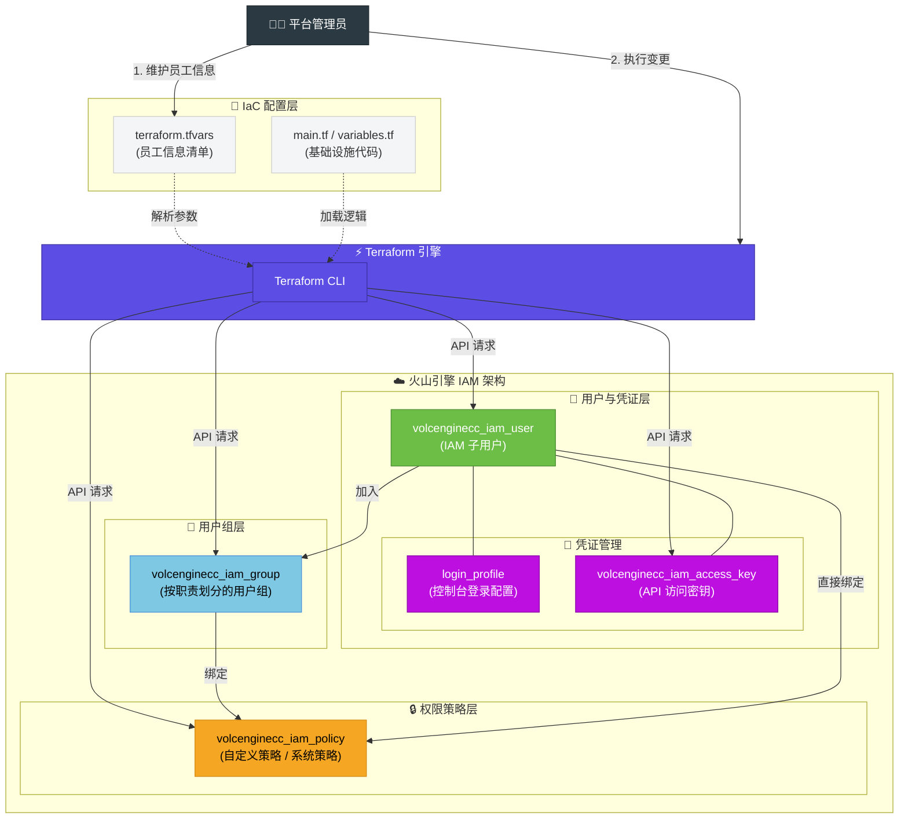

# IAM 用户生命周期自动化管理

## 1. 业务背景

在快速发展的游戏行业中，人员的频繁流动（入职、离职、转岗）为企业的信息技术与安全团队带来了持续的管理挑战。采用火山引擎作为其云基础设施底座，并通过身份与访问管理（Identity and Access Management, IAM）对员工的云资源访问进行管控。

在单账号管理模式下，每一个人员变动事件都需要在火山引擎 IAM 中进行一系列手动操作，这不仅效率低下，还极易引发权限配置错误，构成潜在的安全风险：

1. **操作繁琐，效率低下**：新员工入职，需手动创建 IAM 子用户、设置登录密码、绑定初始访问策略、加入对应的用户组。转岗时，需要更新其用户组和权限。离职时，更要及时、完整地剥离所有访问权限。整个过程涉及多个控制台页面和操作步骤，耗时耗力。
2. **权限配置易出错**：手动配置权限时，容易因人为疏忽导致权限过大或过小。例如，忘记为新员工关联关键权限，或离职员工权限未能完全回收，都可能影响业务的正常运行与数据安全。
3. **审计与合规困难**：手动操作流程缺乏标准化的记录与日志，难以追溯每一次权限变更的原因与执行细节，给安全审计和合规审查带来障碍。
4. **密钥管理不便**：对于需要以编程方式访问云资源的研发人员，其访问密钥的创建、轮转和禁用需要精细化管理，手动操作难以保障其生命周期的安全性。

为了解决以上问题，企业需要一套自动化的解决方案，将人事流程与云资源权限管理无缝衔接，实现 IAM 身份生命周期的自动化、标准化与安全闭环。

## 2. 方案概述

将人员生命周期事件（入职、转岗、离职）作为触发源，通过 Terraform 执行预设的 IaC 模板，从而自动完成 IAM 子用户的创建、权限变更与回收，构建一个响应迅速、安全可靠且易于审计的自动化身份管理体系，对应架构图如下：



### 2.1 核心设计

1. **关键事件**：
   - **入职**：自动创建IAM子用户，分配策略、用户组
   - **转岗**：调整策略、用户组关联关系
   - **离职**：权限剥离，用户归档到特定分组
2. **权限管理**：
   - **通用权限通过用户组继承**：将通用的、跨项目的权限（如某类服务的只读权限）附加到用户组上。员工加入该组后，便自动继承这些权限。
   - **特定权限直接授予**：将需要限定的精细化权限，通过策略直接绑定给用户。
3. **配置要求**：
   - **强制密码重置**：新用户首次登录时，通过设置，强制其修改初始密码。
   - **离职归档**：员工离职时，不立即删除其 IAM 用户，而是将其移入一个特殊用户组，并移除所有直接绑定的策略、禁用控制台登录和禁用 AK/SK。完整地剥离了权限，又保留了其操作历史以备审计。
   - **标签化管理**：为所有创建的 IAM 资源附上标准化的标签，便于后续的资源追溯。
4. **密钥管理**：为需要编程访问的研发人员，可选地对 AK/SK 进行启用、禁用，实现更灵活的生命周期控制。

## 3. IaC 设计

### 3.1 资源与模块依赖

Terraform链接：https://registry.terraform.io/providers/volcengine/volcenginecc/latest/docs/resources/iam_user

| Terraform 资源 | 用途 |
| :--- | :--- |
| `volcenginecc_iam_user` | 最核心的资源，用于定义一个 IAM 子用户。 |
| `volcenginecc_iam_group` | 将一组拥有相同职责的用户与一套权限策略关联起来。通过将用户添加到组，可以实现权限的批量授予和回收。 |
| `volcenginecc_iam_policy` | 权限的具体描述，定义了“允许”或“拒绝”在哪些资源上执行哪些操作。 |
| `volcenginecc_iam_project` | 资源逻辑隔离的容器，通过项目可以将不同业务线的资源进行分组管理。 |
| `volcenginecc_iam_accesskey` | 用于通过 API 或工具进行编程访问的凭证。 |

### 3.2 Terraform 模板

#### 1. 文件目录

```text
terraform-project/
├── main.tf              # 主入口文件
├── variables.tf         # 变量定义
├── outputs.tf           # 输出定义
├── providers.tf         # Provider 配置
├── versions.tf          # 版本约束
├── terraform.tfvars     # 示例配置
└── modules/
    ├── iam-user/        # 用户管理模块
    ├── iam-policy/      # 策略管理模块
    ├── iam-group/       # 用户组管理模块
    ├── iam-project/     # 项目管理模块
    └── iam-accesskey/   # 访问密钥管理模块
```

#### 2. 核心文件示例

```hcl
# 使用可复用的 iam-user 模块批量管理用户

# 批量创建 IAM 用户
module "iam_users" {
  source   = "./modules/iam-user"
  for_each = { for user in var.iam_users : user.user_name => user }

  # 传递用户配置
  user_name             = each.value.user_name
  display_name          = each.value.display_name
  description           = each.value.description
  email                 = each.value.email
  mobile_phone          = each.value.mobile_phone
  groups                = each.value.groups
  policies              = each.value.policies
  tags                  = each.value.tags
  enable_login          = each.value.enable_login
  login_allowed         = each.value.login_allowed
  password              = each.value.password
  password_reset_required = each.value.password_reset_required
  safe_auth_flag        = each.value.safe_auth_flag
  safe_auth_type        = each.value.safe_auth_type
  enable_access_key     = each.value.enable_access_key
  access_key_status     = each.value.access_key_status
  is_offboarding        = each.value.is_offboarding
  offboarding_group     = each.value.offboarding_group
}

# ==============================================
# IAM 用户全生命周期管理
# 三个场景的使用方式：
#
# 1. 入职（Onboarding）：在列表中添加新用户
# 2. 转岗（Transfering）：修改现有用户的 groups/policies/tags
# 3. 离职（Offboarding）：设置 is_offboarding = true
# ==============================================
variable "iam_users" {
  type = list(object({
    user_name             = string
    display_name          = string
    description           = string
    email                 = string
    mobile_phone          = string
    groups                = list(string)
    policies              = list(object({ policy_name = string, policy_type = string }))
    tags                  = list(object({ key = string, value = string }))
    enable_login          = bool
    login_allowed         = bool
    password              = string
    password_reset_required = bool
    safe_auth_flag        = bool
    safe_auth_type        = string
    enable_access_key     = bool
    access_key_status     = string
    is_offboarding        = bool
    offboarding_group     = string
  }))
  description = "IAM 用户列表，用于用户全生命周期管理（入职/转岗/离职）"
  default     = []
}
```

## 4. 使用说明

### 4.1 前置准备

1. **预制信息**：提前在火山引擎控制台创建好需要的用户组（如 DevTeam, OpsTeam, OffboardedUsers）。
2. **认证配置**：
```bash
# 设置环境变量（推荐）
export VOLCENGINE_ACCESS_KEY="你的AK"
export VOLCENGINE_SECRET_KEY="你的SK"
export VOLCENGINE_REGION="cn-beijing"
```
3. **初始化**：
```bash
terraform init
```

### 4.2 入职配置

在 `terraform.tfvars` 的 `iam_users` 列表中添加：

```hcl
{
  user_name             = "新员工用户名"
  display_name          = "新员工姓名"
  description           = "员工描述"
  email                 = "员工邮箱"
  mobile_phone          = "手机号"
  groups                = ["用户组1", "用户组2"]  # 通用权限通过用户组继承
  policies              = [
    {
      policy_name = "自定义策略名"
      policy_type = "Custom"  # 或 "System"
    }
  ]
  tags                  = [
    { key = "env", value = "prod" },
    { key = "department", value = "dev" }
  ]
  enable_login          = true
  login_allowed         = true
  password              = "初始密码"
  password_reset_required = true  # 强制密码重置
  safe_auth_flag        = false  # 是否启用安全认证
  safe_auth_type        = ""     # "phone", "email", "vmfa"
  enable_access_key     = false
  access_key_status     = "active"
  is_offboarding        = false
  offboarding_group     = "OffboardedUsers"
}
```

### 4.3 转岗配置

在 `terraform.tfvars` 中找到该员工配置，修改：

```hcl
{
  user_name             = "员工用户名"
  # ... 其他字段保持不变
  groups                = ["新用户组1", "新用户组2"]  # 更新用户组
  policies              = [                           # 更新策略
    {
      policy_name = "新策略名"
      policy_type = "Custom"
    }
  ]
  tags                  = [                           # 更新标签
    { key = "department", value = "ops" }
  ]
  # ... 其他字段保持不变
}
```

### 4.4 离职配置

在 `terraform.tfvars` 中找到该员工配置，修改：

```hcl
{
  user_name             = "离职员工用户名"
  # ... 其他字段保持不变
  is_offboarding        = true  # 设置为 true，系统会自动：
                                # 1. 将用户组改为 offboarding_group
                                # 2. 清空策略
                                # 3. 禁用登录
                                # 4. 处理访问密钥
  offboarding_group     = "OffboardedUsers"
}
```

### 4.5 执行

```bash
terraform plan  # 预览变更
terraform apply # 执行变更
```

## 5. 总结

通过本方案，企业获得了一套基于 Terraform 的自动化人员管理框架，实现从入职、转岗到离职的全生命周期权限自动化管理，显著提升了 IT 运维效率，并确保了权限变更的及时性、准确性与可审计性。有以下优势：

1. **自动化与效率**：告别手动操作，将人事流程无缝对接到云上权限配置。
2. **安全与合规**：通过“组继承 + 项目域授权”模式，遵循最小权限原则，离职时自动禁用并归档，形成完整闭环。
3. **标准化与可复制**：提供开箱即用的 IaC 模板，确保了跨团队、跨项目权限管理的一致性，新业务可快速复用。

未来，该方案可以进一步与企业的 CMDB、HR 系统或堡垒机等安全系统集成，构建更为统一和立体的云上身份治理体系。
